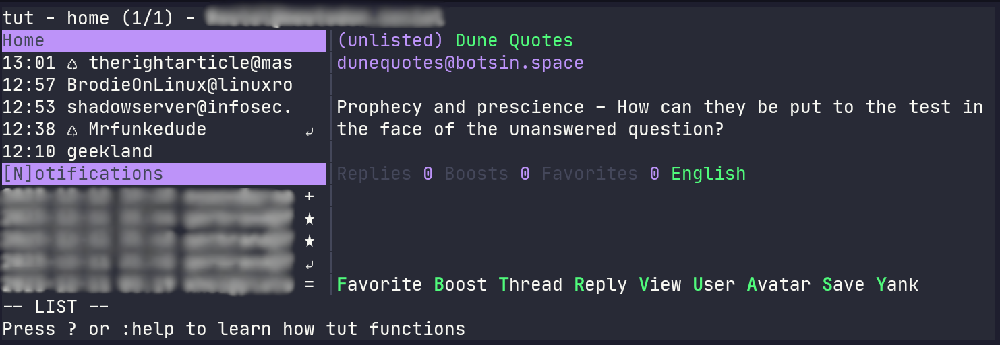

# Dracula for [tut](https://github.com/RasmusLindroth/tut), a Mastodon TUI

> A dark theme for [tut](https://github.com/RasmusLindroth/tut)

Notifications blurred for privacy, random toot displayed, no endorsement implied.

## Install

All instructions can be found at [draculatheme.com/tut](https://draculatheme.com/tut).

## Team

This theme is maintained by the following person(s) and a bunch of
[awesome contributors](https://github.com/dracula/tut/graphs/contributors).

|  |
| --------------------------------------------------------------------------------------- |
| [RastalDev](https://github.com/rastaldev)                                               |

## Community

- [Twitter](https://twitter.com/draculatheme) - Best for getting updates about themes and new stuff.
- [GitHub](https://github.com/dracula/dracula-theme/discussions) - Best for asking questions and discussing issues.
- [Discord](https://draculatheme.com/discord-invite) - Best for hanging out with the community.

## License

[MIT License](./LICENSE)
